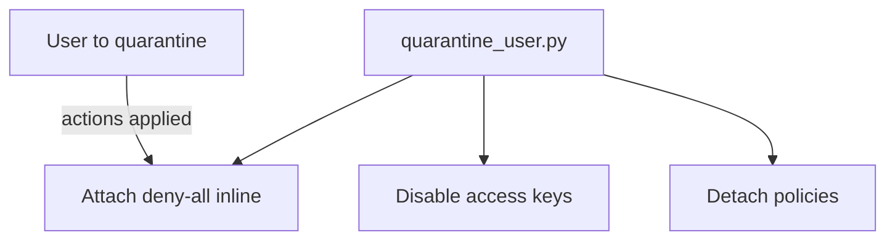

# AWS Security Lab 08: Incident Response Quarantine Script

Python script to quarantine an IAM user by detaching policies, attaching a deny-all policy, and disabling access keys. Designed for quick response.

## Purpose
- Demonstrate automated response to suspected compromise.
- Safely disable user access without deleting the entity.

## Prereqs
- Python 3, boto3 installed (`python -m pip install boto3`).
- AWS credentials with IAM privileges in a sandbox.

## Usage
```bash
python quarantine_user.py <username>
```

## What it does
- Lists and detaches managed policies from the user.
- Puts an inline deny-all policy on the user.
- Deactivates all access keys for the user.

## Tests
- Dry run recommended: inspect actions before use in production. No automated tests.

## Cleanup
- Manually remove the inline policy and reattach required policies if restoring access.

## Diagram

