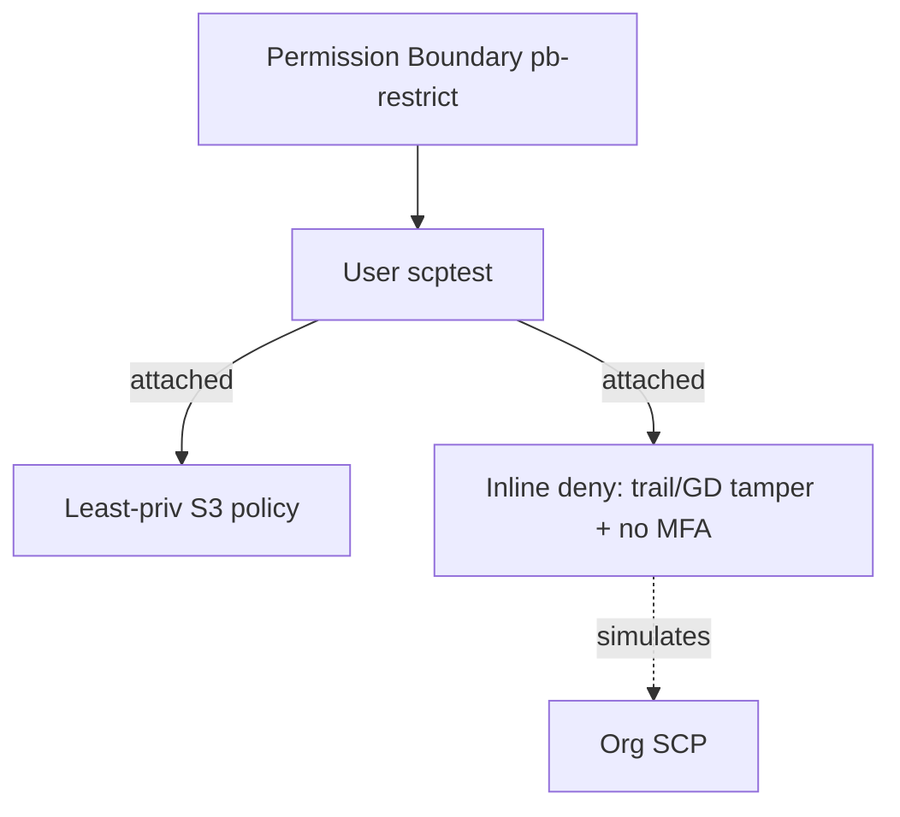

# AWS Security Lab 13: Guardrails with SCPs and Permission Boundaries

Demonstrate org-level guardrails (modeled in a single account) using SCP-like policies and permission boundaries to block dangerous actions: wildcards, CloudTrail/GuardDuty tampering, and no-MFA usage.

## Purpose
- Show how to block high-risk actions even if IAM policies are permissive.
- Use permission boundaries to constrain created roles/users.

## Prereqs
- Terraform, AWS credentials (sandbox), backend disabled (local state).
- This lab simulates SCPs via IAM policies attached to a principal; adapt to Organizations SCP in real org.

## Usage
```bash
cd practice_examples/aws-security/13-scp-guardrails
terraform init -backend=false
terraform fmt -check
terraform validate
terraform plan
```

## What it creates
- IAM policy `pb-restrict` used as a permission boundary: denies `iam:*` wildcard, `s3:*` wildcard, and allows only specific actions.
- IAM user `scptest` with that permission boundary; attached policy with least-priv S3 list/get on a tagged bucket (placeholder).
- Inline deny policy to simulate SCP: denies CloudTrail delete/stop, GuardDuty delete/stop, and denies all if no MFA.

## Tests
- Static: `terraform fmt -check`, `terraform validate`.
- Logic: inspect plan to verify denies on trail/GD and permission boundary restrictions.

## Cleanup
```bash
terraform destroy
```

## Diagram

