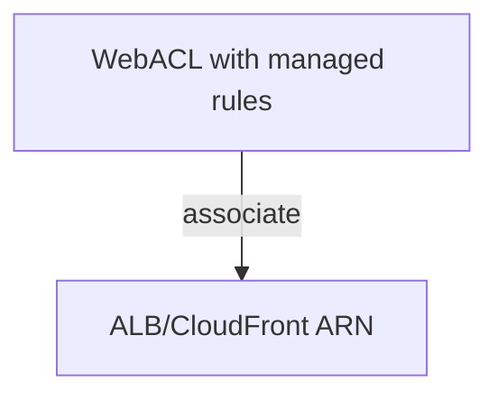

# AWS Security Lab 15: WAFv2 WebACL for ALB/CloudFront

Create a WAFv2 WebACL using AWS managed rule groups and (optionally) associate it to an ALB/CloudFront ARN you provide.

## Purpose
- Add Layer7 protections with managed rule sets.
- Provide a template to attach to an ALB/CloudFront distribution.

## Prereqs
- Terraform, AWS credentials (sandbox), backend disabled (local state).
- Provide a `resource_arn` (ALB ARN or CloudFront ARN) to associate; otherwise it will just create the WebACL.

## Usage
```bash
cd practice_examples/aws-security/15-waf-alb-firewall
terraform init -backend=false
terraform fmt -check
terraform validate
terraform plan -var 'resource_arn=arn:aws:elasticloadbalancing:...'
```

## What it creates
- WAFv2 WebACL with AWSManagedRulesCommonRuleSet + AWSManagedRulesKnownBadInputsRuleSet.
- Optional association to a provided resource ARN (ALB/CloudFront/API Gateway).

## Tests
- Static: `terraform fmt -check`, `terraform validate`.
- Logic: after apply, verify WebACL exists and is associated (if ARN provided); send test requests to trigger managed rules.

## Cleanup
```bash
terraform destroy
```

## Diagram

