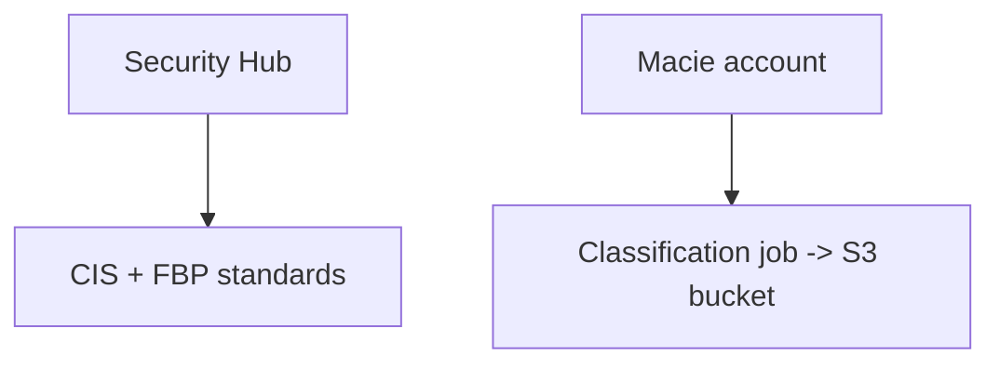

# AWS Security Lab 16: Security Hub + Macie Enablement

Enable Security Hub with CIS + Foundational standards and (optionally) create a Macie classification job for a target S3 bucket.

## Purpose
- Turn on Security Hub with managed standards.
- Demonstrate Macie classification job on a sensitive bucket.

## Prereqs
- Terraform, AWS credentials (sandbox), backend disabled (local state).
- Provide a `macie_bucket` if you want to create a classification job (optional).

## Usage
```bash
cd practice_examples/aws-security/16-securityhub-macie
terraform init -backend=false
terraform fmt -check
terraform validate
terraform plan -var 'macie_bucket=your-sensitive-bucket'
```

## What it creates
- Security Hub enabled with CIS AWS Foundations + Foundational Best Practices standards.
- (Optional) Macie classification job targeting the provided bucket, daily schedule.

## Tests
- Static: `terraform fmt -check`, `terraform validate`.
- Logic: verify plan enables standards; if macie_bucket set, job is created. Use console to confirm findings generation.

## Cleanup
```bash
terraform destroy
```

**Note:** Security Hub/Macie incur costs; use in a sandbox and clean up promptly.

## Diagram

